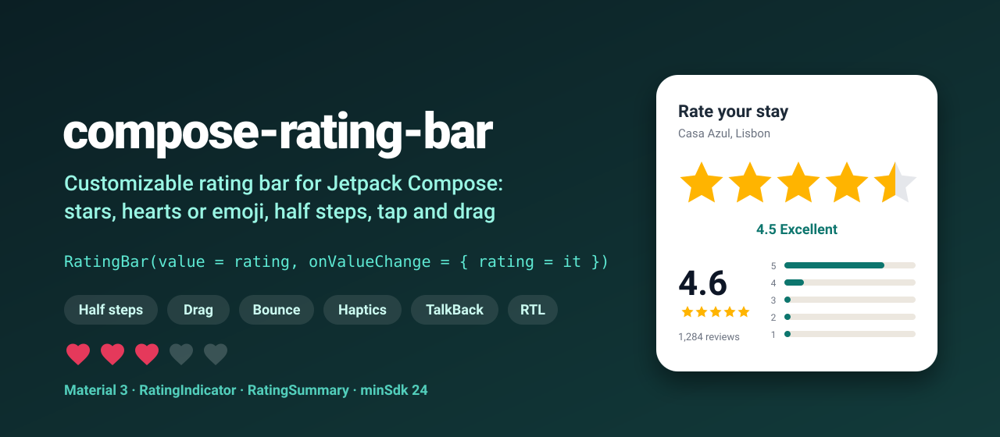
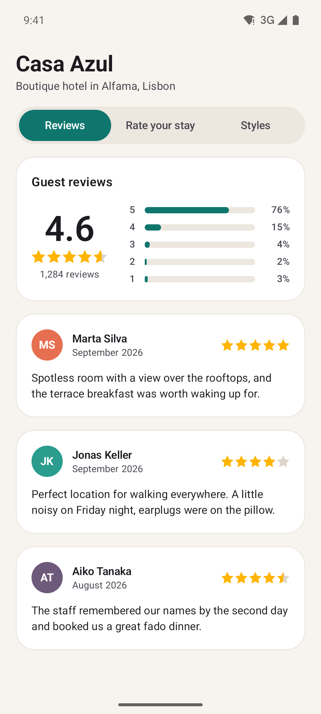
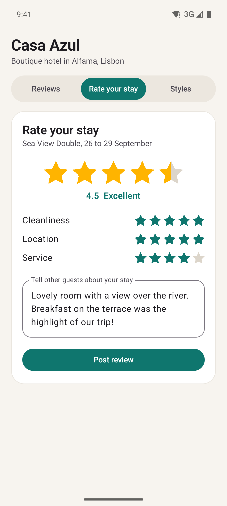
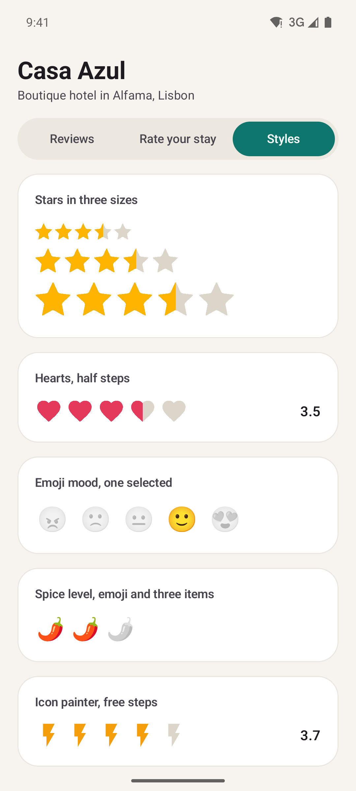
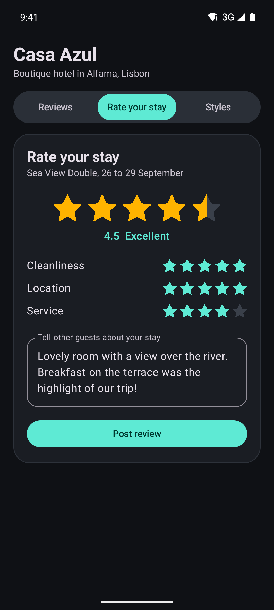

<p align="center">
  
</p>

<p align="center">
  <a href="https://github.com/halilozel1903/compose-rating-bar/actions/workflows/ci.yml"></a>
  <a href="https://jitpack.io/#halilozel1903/compose-rating-bar"></a>
  
  
  
  <a href="LICENSE"></a>
</p>

**compose-rating-bar** is a customizable rating bar for Jetpack Compose. Tap a star or drag across the bar, and the chosen item bounces with a light haptic tick. Use stars, hearts, any shape, an icon, emoji or your own content; choose whole, half or free steps; and get a read-only `RatingIndicator` plus a `RatingSummary` block ("4.6, 1,284 reviews" with distribution bars) in the same small API. TalkBack sees a proper slider it can adjust, keyboard arrows work, and right-to-left layouts fill from the right.

```kotlin
var rating by rememberSaveable { mutableFloatStateOf(0f) }

RatingBar(value = rating, onValueChange = { rating = it })
```

## Screenshots

Captured from the sample app on an Android emulator by CI.

| Review summary | Rate your stay | Styles | Dark mode |
| :---: | :---: | :---: | :---: |
|  |  |  |  |

## Features

- **`RatingBar(value, onValueChange)`**: stateless and controlled, like `Slider`. Tap an item or drag horizontally; vertical scrolling of the parent keeps working.
- **Steps**: `RatingStep.Full` (1, 2, 3), `RatingStep.Half` (3.5, the default) or `RatingStep.Free` (3.7).
- **Styles**: `RatingStyle.Star`, `RatingStyle.Heart`, `RatingStyle.Shaped(anyShape)`, `RatingStyle.Painted(painter)`, `RatingStyle.Emoji(...)` (including a mood scale that highlights only the chosen face) and `RatingStyle.Custom { index, filled -> }`.
- **Partial fill by clipping**: every style supports half and fractional values, 4.6 fills 60 % of the fifth star.
- **Animations**: the selected item bounces, the fill glides between values after a tap, the summary bars grow in one after another.
- **Haptic tick** once per half item while dragging, not on every frame.
- **Accessibility**: a slider for TalkBack with `progressBarRangeInfo`, a readable state ("Rated 4.5 out of 5"), `setProgress` for swipe up and down, and "Increase rating" and "Decrease rating" actions. Keyboard left and right arrows change the value.
- **Right to left**: items start at the right edge and fill from the right, touch mapping included.
- **`RatingIndicator`** for read-only ratings and **`RatingSummary`** / **`RatingDistributionBars`** for review pages. Percentages always add up to 100.
- **Material 3**: colors come from the theme (`primary` and `outlineVariant`) unless you pass your own; `RatingBarDefaults.Gold` is there for classic stars.
- **Pure Kotlin core** (`compose-rating-bar-core`): snapping, position mapping, fill fractions, distribution and formatting math with unit tests.

## Installation

Add JitPack to `settings.gradle.kts`:

```kotlin
dependencyResolutionManagement {
    repositories {
        google()
        mavenCentral()
        maven("https://jitpack.io")
    }
}
```

Then the dependency:

```kotlin
dependencies {
    implementation("com.github.halilozel1903.compose-rating-bar:compose-rating-bar:1.0.0")
    // Pure Kotlin math only (for JVM/KMP modules or your own UI):
    // implementation("com.github.halilozel1903.compose-rating-bar:compose-rating-bar-core:1.0.0")
}
```

> The build is also set up for Maven Central (`io.github.halilozel1903:compose-rating-bar`) via the vanniktech publish plugin.

## Quick start

**A rating to submit**

```kotlin
var rating by rememberSaveable { mutableFloatStateOf(0f) }

RatingBar(
    value = rating,
    onValueChange = { rating = it },
    step = RatingStep.Half,
    itemSize = 44.dp,
    spacing = 8.dp,
    colors = RatingBarDefaults.colors(filledColor = RatingBarDefaults.Gold),
    onValueChangeFinished = { viewModel.save(rating) },   // after a tap, a drag or an accessibility action
)
```

**Show a rating**

```kotlin
RatingIndicator(value = 4.6f)                                   // 18 dp stars, 60 % of the fifth one filled
RatingIndicator(value = review.stars, itemSize = 14.dp, style = RatingStyle.Heart)
```

**A review summary**

```kotlin
val distribution = RatingDistribution.of(5 to 980, 4 to 190, 3 to 58, 2 to 22, 1 to 34)

RatingSummary(distribution, showPercentages = true)
// 4.6, the stars, "1,284 reviews" and five bars

distribution.averageText()   // "4.6"
distribution.percentages()   // [3, 2, 4, 15, 76], always 100 in total
RatingFormat.compact(12_400) // "12K"
```

## Styles

```kotlin
RatingBar(value, onValueChange, style = RatingStyle.Star)                    // default
RatingBar(value, onValueChange, style = RatingStyle.Heart)
RatingBar(value, onValueChange, style = RatingStyle.Shaped(RatingShapes.star(points = 6)))
RatingBar(value, onValueChange, style = RatingStyle.Shaped(CircleShape))

// Icons, tinted with the bar's colors, or in their own colors with tint = false
RatingBar(value, onValueChange, style = RatingStyle.Painted(painterResource(R.drawable.ic_bolt)))
RatingBar(value, onValueChange, style = RatingStyle.Painted(filled = starFilled, empty = starOutline))

// Emoji: one for all items, or one per item. Empty items are drawn grey and faded.
RatingBar(value, onValueChange, max = 3, step = RatingStep.Full, style = RatingStyle.Emoji("🌶️"))
RatingBar(
    value, onValueChange,
    step = RatingStep.Full,
    style = RatingStyle.Emoji(RatingStyle.Emoji.Moods, selectedOnly = true),     // only the chosen face lights up
)

// Anything else
RatingBar(value, onValueChange, step = RatingStep.Full, style = RatingStyle.Custom { index, filled ->
    Box(Modifier.fillMaxSize().background(if (filled) MaterialTheme.colorScheme.primary else MaterialTheme.colorScheme.surfaceVariant, CircleShape)) {
        Text("${index + 1}", Modifier.align(Alignment.Center))
    }
})
```

Every style is drawn twice, empty and filled, and the filled copy is clipped to the item's fill fraction, so half and fractional values work with all of them.

## Configuration

| Parameter | Default | Meaning |
| --- | --- | --- |
| `max` | 5 | Number of items and highest rating |
| `step` | `RatingStep.Half` | `Full`, `Half` or `Free` |
| `style` | `RatingStyle.Star` | What an item looks like |
| `enabled` | `true` | `false` ignores input and uses the disabled colors |
| `itemSize` / `spacing` | 32 dp / 4 dp | A touch in a gap selects the item before it |
| `colors` | theme `primary` / `outlineVariant` | `RatingBarDefaults.colors(...)` |
| `animateSelection` | `true` | Bounce the chosen item and animate the fill |
| `hapticFeedback` | `true` | Tick once per half item |
| `onValueChangeFinished` | `null` | Called when a gesture or action ends |
| `valueDescription` | "Rated 4.5 out of 5" | What TalkBack reads; pass a localized text |
| `increaseActionLabel` / `decreaseActionLabel` | "Increase rating" / "Decrease rating" | Accessibility action labels |

## How a touch becomes a value

```text
position → which item (a gap counts as the item before it) → how far into it
         → round up to the step: anywhere on star 3 = 3, its first half = 2.5 with half steps
         → clamp to 0..max (before the first item = 0, after the last = max)
In RTL the position is measured from the right edge of the bar.
```

It is plain Kotlin, so you can reuse it for your own component:

```kotlin
RatingMath.valueAt(position = 110f, itemSize = 40f, spacing = 10f, itemCount = 5, step = RatingStep.Half) // 2.5
RatingMath.fillFractions(3.5f, itemCount = 5)       // [1, 1, 1, 0.5, 0]
RatingMath.increase(3.5f, RatingStep.Full, max = 5) // 4
```

## Sample app

The `sample` module is the review page of a small hotel with three tabs: the guest reviews with a `RatingSummary`, a "Rate your stay" card (overall rating, three aspect ratings and a comment) and a gallery of styles, sizes, a right-to-left bar and a disabled one.

Taps and drags can't be performed reliably through adb, so the sample opens a screenshot scene from an intent extra (used by `scripts/screenshots.sh`):

```bash
./gradlew :sample:installDebug
adb shell am start -n io.github.halilozel1903.ratingbar.sample/.MainActivity --es scene review
```

`scene` is one of `summary` (the default), `review` (4.5 stars selected with a comment) or `styles`.

## Project structure

| Module | What it is |
| --- | --- |
| `ratingbar-core` | Pure Kotlin: `RatingMath` (snapping, position mapping incl. RTL, fill fractions, keyboard steps), `RatingDistribution`, `RatingFormat`. Published as `compose-rating-bar-core` |
| `ratingbar` | Compose: `RatingBar`, `RatingIndicator`, `RatingSummary`, `RatingDistributionBars`, `RatingStyle`, `RatingShapes`. Published as `compose-rating-bar` |
| `sample` | A hotel review page with screenshot scenes |

## Tech stack

Kotlin 2.4 · AGP 9.4 with built-in Kotlin · Gradle 9.6 · Jetpack Compose (BOM 2026.09) · Material 3 · Compose animation (`Animatable`, springs) · Pointer input gestures · Semantics · GitHub Actions

## License

MIT. See [LICENSE](LICENSE).
